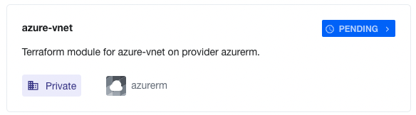

# Uploading Modules to the Terraform Cloud API
Sometimes it is neccessary to upload modules to your Organization's Private Module Registry in Terrraform Cloud using the API instead of a VCS managed repository.


## Overview
Uploading a Private module to the Private Module Registry in Terraform Cloud involves the following steps:

1. Create a Module using the Terraform Cloud API
2. Create a Module Version using the Terraform Cloud API
3. Upload the Module Version using the Terraform Cloud API

### Step 1: Create a Module using the Terraform Cloud API
Create a file named `module-payload.json` that contains the information about the module to create. This will be passed to the API:

```json
{
  "data": {
    "type": "registry-modules",
    "attributes": {
      "name": "azure-vnet",
      "provider": "azurerm",
      "registry-name": "private"
    }
  }
}
```
Pass the payload to the API:

```bash
curl \
  --header "Authorization: Bearer $TFC_TOKEN" \
  --header "Content-Type: application/vnd.api+json" \
  --request POST \
  --data @module-payload.json \
  https://app.terraform.io/api/v2/organizations/$TFC_ORGANIZATION/registry-modules
```
You should see your Module "PENDING" in the Terraform Cloud UI under the "Registry" -> "Modules" tab:



## Step 2: Create a Module Version using the Terraform Cloud API
The Module will remain in a "PENDING" state until we create a version and upload the Module Version.

Create a filed named `version-payload.json`that contains the information about the version to create. This will be passed to the API:

>Note: The version must be in a semantic versioning format ex: 1.0.2
```json
{
  "data": {
    "type": "registry-module-versions",
    "attributes": {
      "version": "1.0.0"
    }
  }
}
```
Pass the payload to the API:
```bash
curl \
  --header "Authorization: Bearer $TFC_TOKEN" \
  --header "Content-Type: application/vnd.api+json" \
  --request POST \
  --data @version-payload.json \
  https://app.terraform.io/api/v2/organizations/$TFC_ORGANIZATION/registry-modules/private/$TFC_ORGANIZATION/$MODULE_NAME/$MODULE_PROVIDER/versions
```
You should get an uload URL in your response from the API similiar to the one below:
```
{"upload":"https://archivist.terraform.io/v1/object/dmF1bHQ6djI6Y1NFWlN...}}}%
```
Copy the upload URL for use in STEP 3.

### Step 3: Upload the Module Version using the Terraform Cloud API
Terraform Cloud expects the module version uploaded to be a tarball with the module in the root (not in a subdirectory).

Using the example `vnet-module` folder structure in this repository, package the files in an archive format by running `tar zcvf module.tar.gz *` in the module's `vnet-module` directory.

```bash
joshuatracy@joshuatracy-V1FW0Q7CVW terraform-modules-api % cd vnet-module 
joshuatracy@joshuatracy-V1FW0Q7CVW vnet-module % tar zcvf module.tar.gz *
a network-security-group.tf
a provider.tf
a resource-group.tf
a variables.tf
a vnet.tf
```
Upload the Module Version tarball file using the following API command and the upload URL you copied in step 2:
```bash
curl \
  --header "Content-Type: application/octet-stream" \
  --request PUT \
  --data-binary @module.tar.gz \
  https://archivist.terraform.io/v1/object/dmF1bHQ6djE6NWJPbHQ4QjV4R1ox...
```
You should get an empty repsonse, but the module should be fully visible in the Registry.

>Note: If there are no errors returned from the API, but the module page shows "Waiting for module to become ready" there is a chance that an errror occured on the Terraform Cloud side. This happens from time to time. Delete the module version and try again.
### Documentation
https://www.terraform.io/cloud-docs/api-docs/private-registry/modules#create-a-module-with-no-vcs-connection